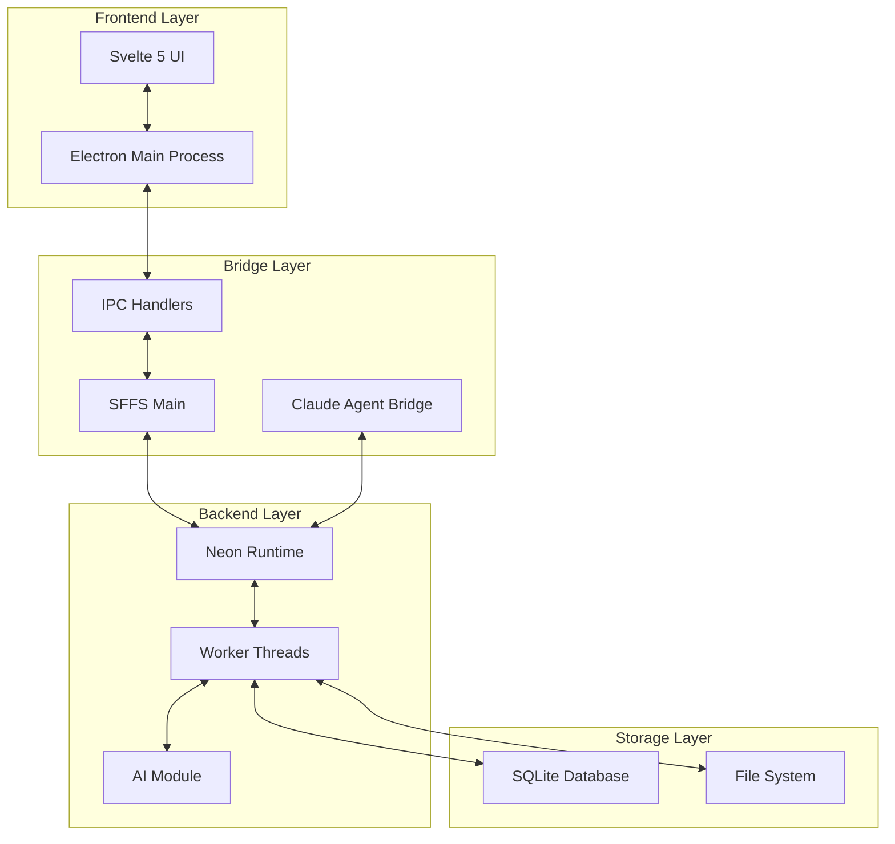
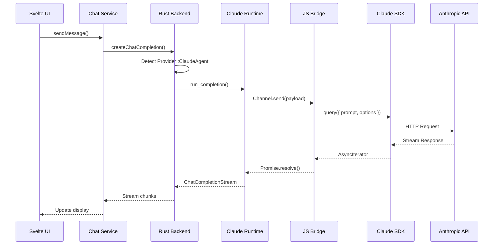

# AI Quickstart: Surf - AI Notebook with Claude Agent Integration

**Last Analysis Date:** 2024-11-17 00:35:00
**Git Branch:** main
**Git Status:** dirty - 18 files modified, 14 files new
**Upstream:** https://github.com/deta/surf.git
**Fork:** https://github.com/guilhermexp/surf.git

## Project Overview

Surf is an AI-powered notebook desktop application that seamlessly integrates files, web content, and multiple AI providers into a unified thinking and research environment. This fork adds comprehensive Claude Code Agent SDK integration, enabling advanced file system operations and code analysis capabilities through a sophisticated multi-layer bridge architecture.

## Architecture Overview

### High-Level Architecture



### Claude Agent Integration Flow



## Data Model

### Core Tables (14 total)

#### 1. Resources

```sql
resources (
    id TEXT PRIMARY KEY,
    resource_path TEXT NOT NULL,
    resource_type TEXT NOT NULL,  -- 'note', 'file', 'web', 'pdf'
    created_at TEXT NOT NULL,
    updated_at TEXT NOT NULL,
    deleted INTEGER DEFAULT 0
)
```

#### 2. Spaces (Notebooks)

```sql
spaces (
    id TEXT PRIMARY KEY,
    name TEXT NOT NULL,
    created_at TEXT NOT NULL,
    updated_at TEXT NOT NULL
)

space_entries (
    id TEXT PRIMARY KEY,
    space_id TEXT REFERENCES spaces(id),
    resource_id TEXT REFERENCES resources(id),
    created_at TEXT NOT NULL,
    updated_at TEXT NOT NULL,
    manually_added INTEGER NOT NULL
)
```

#### 3. AI Sessions

```sql
ai_sessions (
    id TEXT PRIMARY KEY,
    title TEXT NOT NULL DEFAULT '',
    system_prompt TEXT NOT NULL DEFAULT '',
    created_at TEXT DEFAULT NULL,
    updated_at TEXT DEFAULT NULL
)

ai_session_messages (
    ai_session_id TEXT REFERENCES ai_sessions(id),
    role TEXT NOT NULL,  -- 'user', 'assistant', 'system'
    content TEXT NOT NULL,
    sources BLOB NOT NULL,  -- JSON array
    created_at TEXT NOT NULL
)
```

#### 4. Full-Text Search

```sql
-- Virtual tables for search
resource_metadata USING fts5(
    id, resource_id, name, source_uri, alt, user_context,
    tokenize="trigram"
)

resource_text_content USING fts5(
    id, resource_id, content, content_type, metadata,
    tokenize="trigram"
)
```

#### 5. Supporting Tables

- `resource_tags` - Tag system for resources
- `history_entries` - Browser history tracking
- `embedding_resources` - AI embeddings for RAG
- `resource_content_hashes` - Content deduplication
- `post_processing_jobs` - Background job queue
- `apps` - Surflet applications storage
- `sub_space_entries` - Nested notebook entries

## Tech Stack

### Core Technologies

- **Language:** TypeScript (frontend), Rust (backend)
- **Framework:** Electron 39.1.1 + Svelte 5.38.1
- **Database:** SQLite with bundled extensions
- **Build:** Vite 7.1.11 + Turborepo 2.5.6

### AI/LLM Stack

- **Providers:** OpenAI, Anthropic, Google Gemini, Claude Agent
- **Claude SDK:** @anthropic-ai/claude-agent-sdk@0.1.42
- **Embedding:** OCRS + RTEN for local OCR
- **Streaming:** Custom ChatCompletionStream implementation

### Key Libraries

- **Neon:** 1.1.1 (Rust-Node.js bindings)
- **Tokio:** 1.43.1 (async runtime)
- **Reqwest:** 0.11.25 (HTTP client)
- **Crossbeam:** 0.5.15 (channels)
- **Sharp:** 0.33.5 (image processing)
- **Tiptap:** Rich text editor (via @deta/editor)

## Setup

### Prerequisites

```bash
# Node.js 22.18.0+
node --version

# Rust toolchain
rustc --version

# Yarn 1.22.22
yarn --version
```

### Installation

```bash
# Clone repository
git clone https://github.com/guilhermexp/surf.git
cd surf

# Install dependencies
yarn install

# Build Rust backend
yarn workspace @deta/backend build

# Configure Claude Agent (required for Claude features)
export ANTHROPIC_API_KEY=sk-ant-api03-...

# Run development mode
npm run dev

# Build for production
npm run build
```

### Environment Variables

```bash
# Required for Claude Agent
ANTHROPIC_API_KEY=sk-ant-api03-...

# Optional
RUST_LOG=info                    # Logging level
NODE_ENV=development             # Development mode
M_VITE_USE_TMP_DATA_DIR=true   # Use temp directory for data
```

## Key Workflows

### 1. AI Chat Workflow

```
User Message → Chat Service → Backend Selection:
  ├── HTTP Providers (OpenAI, Anthropic, Google)
  │   └── Direct API calls with streaming
  └── Claude Agent Provider
      └── Bridge → SDK → File access + API
```

### 2. Resource Management

```
File/Web Import → Resource Creation → SQLite Storage
                    ├── Content extraction
                    ├── Metadata indexing (FTS5)
                    └── Embedding generation (optional)
```

### 3. Notebook Organization

```
Space (Notebook) → Space Entries → Resources
                     ├── Manual additions
                     ├── Auto-suggestions
                     └── Sub-spaces (nested)
```

### 4. Claude Agent Execution

```
1. Message formatting (Message[] → prompt string)
2. SDK invocation with tools (Read, Write, Bash, etc.)
3. Promise/Future bridge (JS ↔ Rust)
4. Stream assembly and UI updates
```

## Local Modifications (Fork Features)

### Claude Agent Integration (Primary Modification)

**Files Added:**

- `app/src/main/claudeAgent.ts` - Node.js bridge implementation
- `app/src/main/claudeAgentTools.ts` - Tool definitions
- `packages/backend/src/ai/claude_agent.rs` - Rust runtime
- `docs/CLAUDE_AGENT_INTEGRATION.md` - Integration guide
- `.claude/CLAUDE.md` - Project context for Claude

**Files Modified:**

- `packages/types/src/ai.types.ts` - Added Provider.ClaudeAgent enum
- `packages/backend/src/ai/llm/client/mod.rs` - Provider routing
- `packages/backend/src/worker/mod.rs` - Runtime injection
- `app/src/main/sffs.ts` - Bridge registration

### Key Enhancements

1. **Multi-Layer Bridge:** TypeScript → Neon → Rust → Claude SDK
2. **Thread Safety:** Arc<Mutex> wrapper for JS function handles
3. **Promise/Future Conversion:** Seamless async interop
4. **Error Handling:** Comprehensive error propagation
5. **Debug Logging:** Extensive tracing at all layers
6. **Tool Control:** Configurable tool permissions

### Configuration Features

- Customizable timeouts (default 2min, max 5min)
- Switchable permission modes (manual/automatic)
- Project-aware context loading (.claude/CLAUDE.md)
- Custom model selection (Sonnet 4.5, Haiku 4.5)

## Development Guidelines

### Adding New AI Providers

1. Add enum to `packages/types/src/ai.types.ts`
2. Implement provider detection in `llm/client/mod.rs`
3. Create runtime if needed (see `claude_agent.rs`)
4. Update UI model selection in `ModelSettings.svelte`

### Modifying Claude Bridge

1. Always maintain thread safety (Arc/Mutex)
2. Test Promise/Future conversion thoroughly
3. Update TypeScript types in `types/index.ts`
4. Preserve error context through layers

### Database Migrations

```bash
# Add migration file
echo "ALTER TABLE ..." > packages/backend/migrations/X_name.sql

# Migrations run automatically on startup
```

### Testing Claude Integration

```bash
# Basic test
export ANTHROPIC_API_KEY=sk-ant-...
npm run dev
# Select "Claude Code Agent" model
# Test: "Read the package.json file"

# Debug mode
RUST_LOG=debug npm run dev
```

## Critical Context

### Thread Architecture

- **Main Thread:** Electron main process
- **Renderer Threads:** Svelte UI processes
- **Worker Pool:** 12 Rust threads for backend ops
- **Channel Communication:** Crossbeam unbounded channels
- **JS Bridge:** Single-threaded Node.js event loop

### Security Considerations

- All file operations require explicit paths
- Claude tools can be disabled individually
- API keys stored in system keychain (production)
- Local-first architecture (no cloud dependency)

### Performance Notes

- SQLite with write-ahead logging
- FTS5 trigram tokenization for search
- Lazy loading for large resources
- Streaming responses for LLM output

## Common Issues & Solutions

### Claude Bridge Not Registered

```bash
# Verify registration in sffs.ts
grep "registerClaudeAgentBridge" app/src/main/sffs.ts
# Should show line ~136
```

### Neon Build Failures

```bash
cd packages/backend
cargo clean
yarn build
```

### API Key Issues

```bash
# Check environment
echo $ANTHROPIC_API_KEY
# Or configure via Settings UI
```

## Change Log

### 2024-11-17: Initial Analysis

- Complete codebase documentation created
- Claude Agent integration fully documented
- 14 SQLite tables mapped
- Multi-layer architecture diagrammed
- Fork modifications catalogued

## Next Steps

### Immediate Priorities

- [ ] Implement incremental streaming for Claude responses
- [ ] Add MCP custom tools support
- [ ] Improve error messages in UI

### Future Enhancements

- [ ] Multi-agent orchestration
- [ ] Response caching layer
- [ ] Telemetry and analytics
- [ ] Custom system prompts per notebook

---

_This document provides a comprehensive overview for AI assistants and developers working with the Surf codebase. For specific implementation details, refer to the source files mentioned above._
