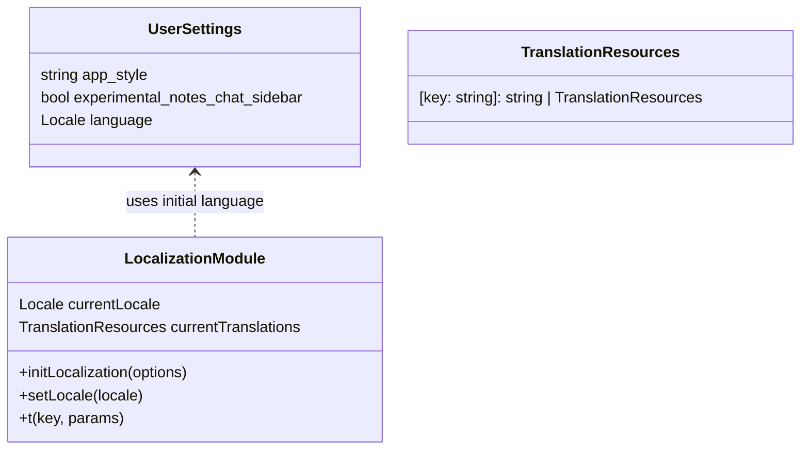

# Design Document

## Overview

This design describes how to add a localization (i18n) system to the Surf desktop application so that users can switch the UI language between English (existing default) and Portuguese from the Settings page. The design focuses on:

- Introducing a dedicated localization layer for the Svelte renderer.
- Defining translation resource files for each supported language.
- Wiring language selection into the existing Settings and configuration mechanisms.
- Ensuring safe fallbacks and future extensibility for more languages.

Scope for the first iteration:

- Localize the main shell/navigation, Settings UI, welcome/onboarding (if present), and common dialogs.
- Support English (en) and Portuguese (pt), with English as the ultimate fallback.

## Architecture

### System Architecture Diagram

```mermaid
graph TB
    subgraph ElectronMain[Electron Main Process]
        M1[Config Service
(read/write user settings)]
    end

    subgraph Renderer[Renderer (Svelte UI)]
        R1[Localization Module
(i18n store and helpers)]
        R2[Settings UI
(Settings.svelte + components)]
        R3[Other UI Components
(shell, dialogs, views)]
    end

    subgraph Assets[Translation Resources]
        A1[en.json]
        A2[pt.json]
    end

    M1 <--> R2
    R2 --> R1
    R3 --> R1
    R1 --> A1
    R1 --> A2
```

Key responsibilities:

- Electron Main / Config Service: persists `language` preference in the existing user settings/config.
- Localization Module (Renderer): holds current language, loads translations, exposes translation helpers/stores.
- Settings UI: exposes language selector and updates both config and localization module.
- Other UI Components: consume translations via keys instead of hard-coded strings.

### Data Flow Diagram

```mermaid
graph LR
    Start[App Startup] --> ReadCfg[Read user config
(language preference)]
    ReadCfg --> InitLang{Language set?}
    InitLang -->|Yes| UseCfg[Use stored language]
    InitLang -->|No| UseDefault[Use default: en]

    UseCfg --> InitI18n[Initialize Localization Module]
    UseDefault --> InitI18n

    InitI18n --> LoadRes[Load translation resources
for current language]
    LoadRes --> RenderUI[Render Svelte UI
with t(key)]

    RenderUI --> ChangeLang[User changes language
in Settings]
    ChangeLang --> UpdateStore[Update i18n current language]
    ChangeLang --> PersistCfg[Persist language in config]

    UpdateStore --> ReloadStrings[Reload/resolve strings
in components]
    ReloadStrings --> RenderUI
```

## Components and Interfaces

### Localization Module (Renderer)

Proposed location:

- `app/src/renderer/Core/i18n.ts` (or similar Core-level module used by the Svelte renderer).

Responsibilities:

- Track the current language (locale) as a Svelte store.
- Load translation resources for the current language (and English as fallback).
- Provide a `t(key, params?)` helper to retrieve translated strings.
- Provide a way to switch language at runtime.

Key interfaces (TypeScript, conceptual):

- `initLocalization(options: LocalizationInitOptions): Promise<void>`

  - Input:
    - `defaultLocale: Locale` (e.g., `"en"`).
    - `supportedLocales: Locale[]` (e.g., `["en", "pt"]`).
    - `initialLocale?: Locale` (from config, optional).
  - Behavior:
    - Determine the effective locale: if `initialLocale` is supported, use it; otherwise use `defaultLocale`.
    - Load required translation resources for that locale.
    - Initialize internal Svelte stores.

- `setLocale(locale: Locale): Promise<void>`

  - Behavior:
    - If `locale` is not supported, ignore and keep current locale.
    - Load translation resources for the new locale.
    - Update Svelte stores so observers re-render.

- `getLocale(): Locale`

  - Behavior:
    - Return the current locale from the store.

- `t(key: string, params?: Record<string, string | number>): string`

  - Behavior:
    - Resolve a string by key from the current language.
    - If missing, fall back to English.
    - If still missing, return a safe placeholder (e.g., the key itself).

- Svelte stores:
  - `locale`: readable/writable store for the current locale.
  - `translations`: internal store mapping keys to strings for the current locale.

### Settings UI

Relevant existing file:

- `app/src/renderer/Settings/Settings.svelte`

New responsibilities:

- Display a language selector (e.g., dropdown with EN/PT) in the Settings UI.
- On change:
  - Update the localization module via `setLocale`.
  - Persist the choice via `window.api.updateUserConfigSettings` (adding a `language` or `locale` field inside `UserSettings`).

Possible structure:

- Add a new Settings section or option using existing `SettingsOption` / similar components, for example under a "General" tab.
- Language selector options:
  - English (en)
  - Português (pt)

### Electron Main / Config Service

Existing usage from `Settings.svelte`:

- `window.api.getUserConfig()` returns `UserConfig` with `settings: UserSettings`.
- `window.api.updateUserConfigSettings(userConfigSettings)` persists settings.

Design changes:

- Extend `UserSettings` (in `@deta/types`) to include a language field, for example:
  - `language?: Locale` or `locale?: Locale`.
- Ensure `getUserConfig` returns this field, defaulting to `"en"` if not set.
- Ensure `updateUserConfigSettings` persists the chosen language alongside other settings.

The localization module in the renderer will read the initial language from `UserConfig.settings.language` (or `locale`) via `window.api.getUserConfig()` during renderer initialization.

### Other UI Components

- All components that currently contain hard-coded user-facing strings (labels, button text, tooltips, dialogs) will be progressively refactored to use `t(key)`.
- Examples of affected areas:
  - Main navigation/shell components in `app/src/renderer/Core` and `app/src/renderer/components`.
  - Dialogs opened via `@deta/ui` (titles/messages passed as strings).
  - Settings subcomponents under `app/src/renderer/Settings/components`.

The design encourages grouping translation keys by feature or view to keep resource files maintainable.

## Data Models

### Core Types

Conceptual TypeScript interfaces (to be implemented in the appropriate shared/types package):

```ts
// app/src/renderer/Core/i18n.ts or shared types
export type Locale = 'en' | 'pt'

export interface LocalizationInitOptions {
  defaultLocale: Locale
  supportedLocales: Locale[]
  initialLocale?: Locale
}

export interface TranslationResources {
  [key: string]: string | TranslationResources
}
```

User settings extension (conceptual):

```ts
// In @deta/types user settings model
export interface UserSettings {
  // existing fields ...
  language?: Locale // 'en' | 'pt', default 'en'
}
```

### Translation Resource Files

Proposed location for translation resources:

- `app/src/renderer/assets/locales/en.json`
- `app/src/renderer/assets/locales/pt.json`

Example structure:

```json
{
  "app": {
    "title": "Surf",
    "menu": {
      "file": "File",
      "edit": "Edit"
    }
  },
  "settings": {
    "general": {
      "title": "General",
      "language": {
        "label": "Language",
        "option": {
          "en": "English",
          "pt": "Portuguese"
        }
      }
    }
  }
}
```

Portuguese file will mirror this structure with translated strings.

### Data Model Diagrams



## Business Process

### Process 1: Application Startup and Localization Initialization

```mermaid
flowchart TD
    A[Electron app launch] --> B[Main process loads user config]
    B --> C{settings.language defined?}
    C -->|Yes| D[Use settings.language as initialLocale]
    C -->|No| E[Use defaultLocale 'en']

    D --> F[Renderer bootstraps Svelte app]
    E --> F

    F --> G[initLocalization({defaultLocale:'en', supportedLocales:['en','pt'], initialLocale})]
    G --> H[Load en.json and selected language file]
    H --> I[Expose t(key) and locale store]
    I --> J[Render UI components using t(key)]
```

### Process 2: User Changes Language in Settings

```mermaid
flowchart TD
    A[User opens Settings.svelte] --> B[Language selector shows current locale]
    B --> C[User selects new language]
    C --> D[Settings.svelte calls setLocale(newLocale)]
    D --> E[Localization module loads resources for newLocale]
    E --> F[UI re-renders with new language via t(key)]

    C --> G[Settings.svelte updates userConfigSettings.language]
    G --> H[window.api.updateUserConfigSettings(userConfigSettings)]
    H --> I[Main process persists updated config]
```

This ensures immediate visual feedback in the Settings window (and other views) plus persistence across restarts.

## Error Handling

The localization system must be robust and fail-safe, matching the requirements.

Scenarios and behavior:

1. Missing language file (e.g., `pt.json` not found or unreadable)

   - On initialization or language switch:
     - Log an error through the existing logging mechanism in the renderer or main process.
     - Fall back to English (`en.json`).
     - Keep the UI functional; only texts may appear in English.

2. Malformed translation file (JSON parse error)

   - Catch parse errors when loading resources.
   - Log a clear diagnostic message with file name and locale.
   - Fall back to English resources.

3. Missing key in selected language

   - When `t(key)` is called:
     - If key is missing in the current locale, look it up in English.
     - If still missing, return a safe placeholder (e.g., the raw key string) and log in a debug channel (optional) to help developers fill gaps.

4. Unsupported locale value in config
   - If `settings.language` contains an unknown value:
     - Ignore it.
     - Default to `en`.
     - Persist corrected value on next successful language change.

The error handling strategy guarantees that localization issues never crash the app or leave the UI unusable.

## Testing Strategy

### Unit Tests

Focus on the localization module behavior:

- `initLocalization`:
  - Given a supported `initialLocale`, initializes with that language.
  - Given an unsupported `initialLocale`, falls back to `defaultLocale`.
- `setLocale`:
  - Switching between `en` and `pt` updates `locale` store and translations.
  - Attempting to set an unsupported locale leaves the current locale unchanged.
- `t(key)`:
  - Returns expected strings for known keys in both `en` and `pt`.
  - Falls back to English when key is missing in `pt`.
  - Returns placeholder when key is missing in both.

Implementation detail:

- Place tests near the localization module (e.g., `app/src/renderer/Core/__tests__/i18n.test.ts`) or follow existing test conventions in the repo.

### Integration Tests

Renderer-side integration:

- Settings UI:
  - When opening Settings with `language = 'en'`, the selector shows English and some sample text is in English.
  - When changing to `pt`, visible labels in Settings and at least one other view switch to Portuguese.

End-to-end / higher-level scenarios (where feasible):

- Start app with no language set in config:
  - UI starts in English; selector shows English.
- Start app with `language = 'pt'` in config:
  - UI starts in Portuguese; selector shows Portuguese.

### Manual QA Checklist

- Verify Settings shows a clear language selector with English and Portuguese.
- Toggle between languages and confirm that:
  - Settings labels change.
  - Main navigation/menu labels change (where wired to i18n).
  - Common dialogs (e.g., generic error, confirmations) display translated text.
- Simulate corrupted or missing translation file and verify app still runs with English.

---

Design decisions and rationale:

- Use key-based translation resources stored in JSON to keep it simple and compatible with bundling via Vite.
- Centralize localization in a dedicated module to avoid scattering language logic across components.
- Persist language in the existing user settings model to align with current configuration patterns and avoid new storage mechanisms.
- Implement fallbacks to English to ensure safe behavior even when translations are incomplete.
