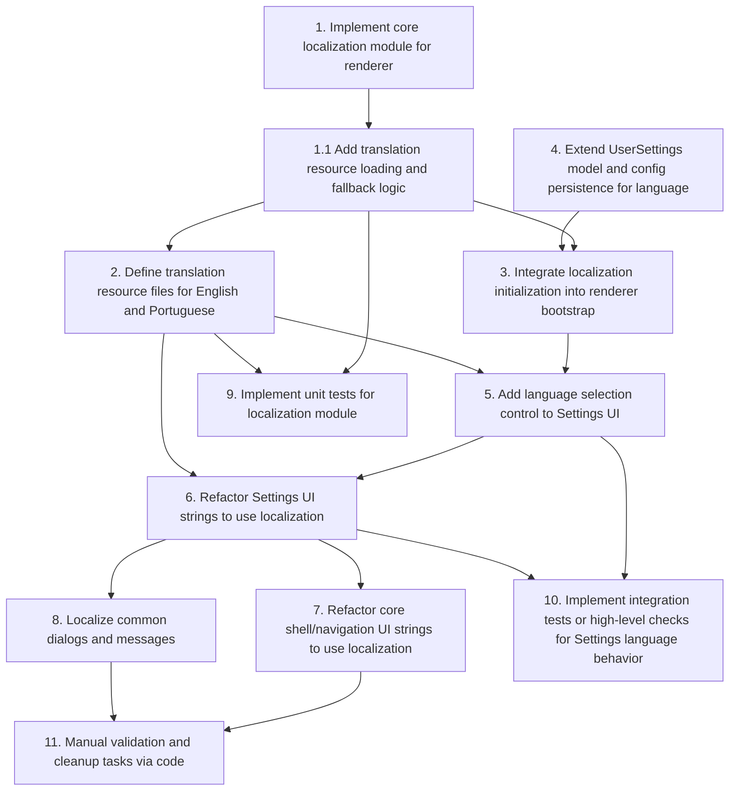

# Implementation Plan: app-localization

- [ ] 1. Implement core localization module for renderer

  - Create a dedicated i18n module (e.g., app/src/renderer/Core/i18n.ts) that manages current locale, loads translation resources, and exposes a t(key) helper.
  - Implement initLocalization(options) to set up defaultLocale ('en'), supportedLocales (['en','pt']), and initialLocale from user config.
  - Implement setLocale(locale) to switch language at runtime, reload resources, and update Svelte stores.
  - Implement t(key, params?) to resolve strings with fallback to English and safe placeholder behavior.
  - Ensure the module uses key-based access and is friendly to Svelte components (stores, reactivity).
  - _Requirements: FR-1, FR-2, FR-5, FR-6, TR-1, TR-3, TR-4, TR-7, TR-8, NFR-4, NFR-5_

- [ ] 1.1 Add translation resource loading and fallback logic

  - Load translation resources from language-specific files under app/src/renderer/assets/locales/ (e.g., en.json, pt.json).
  - Implement logic to merge or overlay current locale resources on top of English so that missing keys fall back to English.
  - Handle JSON parse errors and missing files by logging and falling back to English.
  - Expose internal structures so t(key) can safely navigate nested keys.
  - _Requirements: FR-2, FR-5, TR-2, TR-7, TR-8_

- [ ] 2. Define translation resource files for English and Portuguese

  - Create app/src/renderer/assets/locales/en.json with keys for app shell, Settings, and common dialogs.
  - Create app/src/renderer/assets/locales/pt.json mirroring the same structure with Portuguese translations.
  - Ensure keys are grouped by domain (e.g., app, settings.general, dialogs).
  - Include strings used in Settings.svelte and its components for language selection, general labels, and any existing texts.
  - _Requirements: FR-2, FR-4, FR-6, TR-2, NFR-2, NFR-4_

- [ ] 3. Integrate localization initialization into renderer bootstrap

  - Identify the main renderer entrypoint (e.g., app/src/renderer/main or similar) and call initLocalization during app startup.
  - Obtain initial language from window.api.getUserConfig().settings.language (or locale) via an existing API call.
  - If no language is configured or it is unsupported, use 'en' as default.
  - Ensure that UI components render only after localization has been initialized (e.g., await initLocalization before mounting the root Svelte component).
  - _Requirements: FR-1, FR-3, TR-1, TR-4, TR-5, TR-6, TR-7_

- [ ] 4. Extend UserSettings model and config persistence for language

  - Update the UserSettings type in @deta/types to include a language or locale field (e.g., 'language?: Locale').
  - Ensure the Electron main/config layer persists this field alongside existing settings.
  - Update window.api.getUserConfig() implementation (backend) to return the language field with a default of 'en' when missing.
  - Update window.api.updateUserConfigSettings() implementation (backend) to handle and persist the new language field.
  - _Requirements: FR-1, FR-3, TR-5, TR-6, NFR-4, NFR-5_

- [ ] 5. Add language selection control to Settings UI

  - In app/src/renderer/Settings/Settings.svelte, add a new settings option for language selection under the appropriate tab (e.g., General).
  - Implement a dropdown or similar control with at least 'English' and 'Português' options.
  - Initialize the control based on userConfig.settings.language (or 'en' by default).
  - On change, update the localization module via setLocale(newLocale) and update userConfigSettings.language, then call window.api.updateUserConfigSettings(userConfigSettings).
  - Ensure the Settings window reflects the language change immediately for its own labels where localized.
  - _Requirements: FR-1, FR-2, FR-3, TR-4, TR-5, TR-6, NFR-1, NFR-2_

- [ ] 6. Refactor Settings UI strings to use localization

  - Identify all user-facing strings in app/src/renderer/Settings/Settings.svelte and related components under app/src/renderer/Settings/components.
  - Replace hard-coded literals (labels, section titles, helper texts) with calls to t(key) using keys defined in en.json/pt.json.
  - Ensure that the new translation keys are descriptive and organized by settings section.
  - Verify that Settings UI remains readable and not truncated in both English and Portuguese.
  - _Requirements: FR-2, FR-4, NFR-2, NFR-3, NFR-4_

- [ ] 7. Refactor core shell/navigation UI strings to use localization

  - Locate core shell and navigation components in app/src/renderer/Core and app/src/renderer/components that contain user-facing text.
  - Replace hard-coded strings (menu items, titles, common labels) with t(key) references.
  - Add corresponding keys to en.json and pt.json and provide accurate translations.
  - Verify that main workspace/shell UI looks correct in both English and Portuguese (no overlapping or broken layouts).
  - _Requirements: FR-2, FR-4, NFR-2, NFR-3, NFR-4_

- [ ] 8. Localize common dialogs and messages

  - Identify frequently used dialogs and messages (e.g., confirmations, error messages) that are visible to end users.
  - Replace hard-coded dialog titles/messages with t(key) calls and add appropriate entries in en.json and pt.json.
  - Ensure that dialog behavior (buttons, flows) remains unchanged except for text content.
  - _Requirements: FR-2, FR-4, FR-5, NFR-2, NFR-3_

- [ ] 9. Implement unit tests for localization module

  - Add tests for initLocalization, setLocale, and t(key) in an appropriate test file (e.g., app/src/renderer/Core/**tests**/i18n.test.ts or similar pattern used in the repo).
  - Cover scenarios: supported and unsupported initialLocale, language switching between 'en' and 'pt', fallback to English when keys are missing, and placeholder behavior when keys are missing in both.
  - Ensure tests validate that internal stores update correctly and that performance remains acceptable for normal usage.
  - Copy resulting test files into ai_specs/app-localization/tests/renderer/Core/i18n.test.ts for review.
  - _Requirements: TR-7, TR-8, NFR-5_

- [ ] 10. Implement integration tests or high-level checks for Settings language behavior

  - Add integration or component tests to verify that Settings language selector reflects the current language and updates correctly when changed.
  - Verify that changing language updates at least some visible labels in Settings and shell.
  - Ensure that language preference is read from and written to config as expected across simulated sessions.
  - Copy resulting test files into ai_specs/app-localization/tests/renderer/Settings/language-behavior.test.ts (mirroring project paths) for review.
  - _Requirements: FR-1, FR-2, FR-3, TR-5, TR-6, NFR-5_

- [ ] 11. Manual validation and cleanup tasks via code
  - Add small developer-only diagnostics (e.g., optional debug log or helper) that can list missing translation keys at runtime in development builds.
  - Remove or minimize any legacy hard-coded strings left in localized areas by searching for remaining literals and either localizing them or marking them for future localization.
  - Ensure that any new localization-related config or code paths are covered by existing build scripts (no changes required to the Electron builder config beyond ensuring assets are bundled).
  - _Requirements: FR-4, FR-5, FR-6, TR-7, TR-8, NFR-4, NFR-5_

## Tasks Dependency Diagram

