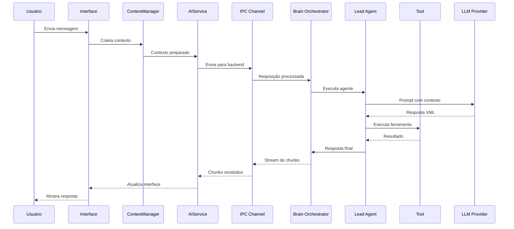

# Relatório de Arquitetura do Agente AI - Surf Browser

## Sumário Executivo

O Surf é um navegador web avançado que integra um agente AI sofisticado capaz de realizar pesquisas na web, gerar aplicações interativas (Surflets) e processar contexto de múltiplas fontes. A arquitetura segue um design de sistema multi-camadas com componentes em TypeScript/Svelte no frontend e Rust no backend, utilizando um padrão de orquestração de agentes para coordenar diferentes ferramentas e capacidades.

## 1. Visão Geral da Arquitetura

### 1.1 Estrutura de Alto Nível

```
┌─────────────────────────────────────────────────────┐
│                   Frontend (Electron)                │
│  ┌─────────────┐  ┌─────────────┐  ┌─────────────┐ │
│  │   UI/UX     │  │  Services   │  │   Editor    │ │
│  │  (Svelte)   │  │(TypeScript) │  │  (Monaco)   │ │
│  └─────────────┘  └─────────────┘  └─────────────┘ │
└─────────────────────────┬───────────────────────────┘
                          │ IPC
┌─────────────────────────┴───────────────────────────┐
│                   Backend (Rust)                     │
│  ┌─────────────────────────────────────────────┐   │
│  │            Brain Orchestrator                │   │
│  │  ┌──────────┐ ┌──────────┐ ┌──────────────┐│   │
│  │  │Lead Agent│ │WebSearch │ │Surflet Agent ││   │
│  │  └──────────┘ └──────────┘ └──────────────┘│   │
│  └─────────────────────────────────────────────┘   │
│  ┌─────────────────────────────────────────────┐   │
│  │         LLM Client & Model Manager          │   │
│  └─────────────────────────────────────────────┘   │
└─────────────────────────────────────────────────────┘
```

### 1.2 Componentes Principais

- **Frontend Services**: Gerenciamento de estado, contexto e interface do usuário
- **Backend Brain**: Orquestração de agentes e processamento de comandos
- **Tool System**: Sistema extensível de ferramentas para capacidades específicas
- **Context Management**: Gestão inteligente de contexto multi-fonte

## 2. Arquitetura do Sistema de Agentes

### 2.1 Orquestrador Principal (Brain Orchestrator)

O `Orchestrator` (localizado em `/packages/backend/src/ai/brain/orchestrator.rs`) é o componente central que:

- **Coordena múltiplos agentes especializados**
- **Gerencia o fluxo de execução entre ferramentas**
- **Mantém o estado da conversação**
- **Processa respostas em streaming**

```rust
pub struct Orchestrator {
    api_base: String,
    api_key: String,
    llm_client: Arc<LLMClient>,
    model: Model,
    lead_agent: Option<Agent>,
    js_tool_registry: Arc<JSToolRegistry>,
}
```

### 2.2 Lead Agent (Agente Principal)

O Lead Agent é o coordenador principal que:

- Analisa requisições do usuário
- Decide quais ferramentas utilizar
- Sintetiza resultados em respostas formatadas
- Gerencia até 10 iterações de processamento

### 2.3 Agentes Especializados

#### 2.3.1 WebSearch Agent

- **Função**: Realiza pesquisas na web
- **Ferramenta**: `SearchEngineCaller`
- **Capacidades**:
  - Executa queries de pesquisa
  - Processa resultados de múltiplas fontes
  - Adiciona URLs ao contexto automaticamente

#### 2.3.2 Surflet Agent

- **Função**: Cria aplicações interativas
- **Ferramenta**: `SurfletCreator`
- **Capacidades**:
  - Gera código de aplicações baseado em prompts
  - Cria interfaces interativas personalizadas
  - Integra com o sistema de renderização do navegador

#### 2.3.3 Context Manager Agent

- **Função**: Gerencia contexto da conversação
- **Ferramenta**: `ContextManagementTool`
- **Capacidades**:
  - Mantém histórico de contexto
  - Gerencia citações e referências
  - Otimiza uso de memória contextual

## 3. Sistema de Ferramentas (Tool System)

### 3.1 Interface de Ferramentas

```rust
pub trait Tool: Send + Sync {
    fn name(&self) -> &str;
    fn description(&self) -> &str;
    fn execution_message(&self) -> Option<&str>;
    fn parameters_schema(&self) -> serde_json::Value;
    fn execute(...) -> BackendResult<()>;
}
```

### 3.2 Ferramentas Disponíveis

| Ferramenta       | ID                 | Descrição                   | Status       |
| ---------------- | ------------------ | --------------------------- | ------------ |
| Web Search       | `websearch`        | Busca informações na web    | Ativo        |
| App Generation   | `surflet`          | Cria aplicações interativas | Ativo        |
| Image Generation | `image-generation` | Gera imagens                | Desabilitado |

### 3.3 Fluxo de Execução de Ferramentas

1. **Parsing XML**: O agente analisa a resposta do LLM em formato XML
2. **Tool Call Detection**: Identifica chamadas de ferramentas na resposta
3. **Parameter Extraction**: Extrai parâmetros necessários
4. **Tool Execution**: Executa a ferramenta apropriada
5. **Result Integration**: Integra resultados no contexto

## 4. Gestão de Contexto

### 4.1 Context Manager (Frontend)

O `ContextManager` (TypeScript) gerencia:

- **Tabs em contexto**: Páginas web abertas
- **Recursos**: Documentos, PDFs, notas
- **Screenshots**: Capturas de tela
- **Espaços**: Coleções de recursos
- **Histórico de navegação**

### 4.2 Tipos de Contexto

```typescript
export enum ContextItemTypes {
  ActiveTab, // Aba ativa atual
  PageTab, // Aba específica
  Resource, // Recurso salvo
  Screenshot, // Captura de tela
  Space, // Espaço de trabalho
  Notebook, // Notebook
  Inbox, // Caixa de entrada
  Everything, // Todo o conteúdo
  Wikipedia, // Pesquisa Wikipedia
  WebSearch, // Pesquisa web
  History // Histórico de navegação
}
```

### 4.3 Processamento de Contexto

1. **Coleta**: Agregação de itens relevantes
2. **Filtragem**: Seleção baseada em relevância
3. **Embedding**: Conversão para vetores (quando necessário)
4. **Ranking**: Ordenação por similaridade
5. **Injeção**: Inclusão no prompt do LLM

## 5. Fluxo de Mensagens

### 5.1 Pipeline de Processamento

```
Usuário → UI → AIService → Backend Brain → LLM → Resposta
         ↑                                      ↓
         └────────── Streaming Response ────────┘
```

### 5.2 Etapas Detalhadas

1. **Input do Usuário**: Mensagem enviada através da interface
2. **Preparação de Contexto**: ContextManager coleta informações relevantes
3. **Envio para Backend**: Via IPC com contexto e configurações
4. **Orquestração**: Brain Orchestrator processa com agentes
5. **Streaming de Resposta**: Chunks enviados progressivamente
6. **Renderização**: UI atualiza em tempo real

### 5.3 Formato de Mensagens

```typescript
export type AIChatMessage = {
  id: string
  ai_session_id: string
  role: 'user' | 'system' | 'assistant'
  status: 'success' | 'pending' | 'error'
  query: string
  content: string
  sources?: AIChatMessageSource[]
}
```

## 6. Integração com Modelos LLM

### 6.1 Provedores Suportados

- **OpenAI**: GPT-4, GPT-4o, GPT-5
- **Anthropic**: Claude 3.5 Sonnet, Claude Haiku
- **Google**: Gemini 2.0 Flash
- **Custom**: Ollama, OpenRouter, Hugging Face

### 6.2 Configuração de Modelos

```typescript
export type Model = {
  id: string
  label: string
  provider: Provider
  tier: ModelTiers
  icon: string
  vision: boolean
  supports_json_format?: boolean
  max_tokens?: number
  custom_key?: string
  provider_url?: string
}
```

### 6.3 Seleção Dinâmica de Modelo

O sistema seleciona automaticamente o modelo apropriado baseado em:

- **Complexidade da tarefa**
- **Necessidade de visão computacional**
- **Limites de quota**
- **Preferências do usuário**

## 7. Sistema de Prompts

### 7.1 Estrutura de System Prompts

O Lead Agent utiliza um prompt sofisticado que define:

- **Papel e responsabilidades**
- **Estratégias de seleção de ferramentas**
- **Guidelines de formatação HTML**
- **Regras de citação**
- **Padrões de qualidade**

### 7.2 Prompts Especializados

- **`CHAT_TITLE_GENERATOR_PROMPT`**: Gera títulos para conversas
- **`CLASSIFY_CHAT_MODE`**: Determina modo de processamento
- **`CLASSIFY_NOTE_CHAT_MODE`**: Classifica contexto de notas
- **`PAGE_PROMPTS_GENERATOR_PROMPT`**: Gera prompts contextuais

## 8. Capacidades Avançadas

### 8.1 Processamento em Streaming

```rust
fn process_streaming_response_xml(
    &self,
    mut stream: ChatCompletionStream,
    io: &dyn AgentIO,
    context_manager: &dyn ContextManager,
) -> BackendResult<String>
```

- **Parsing incremental de XML**
- **Detecção de tags em tempo real**
- **Escrita progressiva no IO**
- **Gestão de estados de streaming**

### 8.2 Sistema de Citações

```xml
<citation>
    <context_id>EXACT_CONTEXT_ID</context_id>
    <cited_text>Início do texto;;;Final do texto</cited_text>
</citation>
```

- **Rastreamento preciso de fontes**
- **Linking automático com recursos**
- **Highlighting em tempo real**

### 8.3 Geração de Aplicações (Surflets)

1. **Análise de requisitos do usuário**
2. **Geração de código HTML/JS/CSS**
3. **Injeção no contexto do navegador**
4. **Execução sandboxed**
5. **Interação com o usuário**

## 9. Gestão de Estado

### 9.1 Stores Svelte (Frontend)

```typescript
class AIChat {
  title: Writable<string>
  messages: Writable<AIChatMessage[]>
  currentParsedMessages: Writable<AIChatMessageParsed[]>
  error: Writable<ChatError | null>
  status: Writable<'idle' | 'running' | 'error'>
  selectedModelId: Writable<string | null>
}
```

### 9.2 Estado do Backend

- **Active Generations**: Rastreamento de gerações em andamento
- **Tool Usage History**: Histórico de uso de ferramentas
- **Context State**: Estado atual do contexto
- **Cancellation Tokens**: Controle de cancelamento

## 10. Comunicação IPC

### 10.1 Eventos Principais

- `tokenCreate`: Criação de tokens de acesso
- `captureWebContents`: Captura de screenshots
- `getUserConfig`: Obtenção de configurações
- `sendAIChatMessage`: Envio de mensagens ao chat

### 10.2 Segurança IPC

```typescript
export const validateIPCSender = (event: IpcMainEvent) => {
  // Validação de origem
  // Verificação de IDs válidos
  // Prevenção de spoofing
}
```

## 11. Padrões de Design Identificados

### 11.1 Padrões Arquiteturais

- **Orchestrator Pattern**: Coordenação central de agentes
- **Strategy Pattern**: Seleção dinâmica de ferramentas
- **Observer Pattern**: Stores reativos Svelte
- **Chain of Responsibility**: Pipeline de processamento

### 11.2 Princípios de Design

- **Separation of Concerns**: Clara separação entre UI, lógica e dados
- **Single Responsibility**: Cada agente tem responsabilidade específica
- **Open/Closed**: Sistema extensível para novas ferramentas
- **Dependency Injection**: Injeção de dependências via construtores

## 12. Decisões Arquiteturais Notáveis

### 12.1 Uso de Rust no Backend

**Vantagens**:

- Performance superior para processamento intensivo
- Segurança de memória garantida
- Concorrência eficiente
- Integração nativa com sistema operacional

### 12.2 Streaming de Respostas

**Benefícios**:

- Feedback imediato ao usuário
- Redução de latência percebida
- Possibilidade de cancelamento
- Uso eficiente de memória

### 12.3 Sistema de Contexto Multi-fonte

**Características**:

- Agregação inteligente de informações
- Priorização baseada em relevância
- Caching eficiente
- Gestão automática de limite de tokens

### 12.4 Arquitetura de Plugins para Ferramentas

**Vantagens**:

- Fácil adição de novas capacidades
- Isolamento de falhas
- Testabilidade independente
- Versionamento modular

## 13. Fluxo de Execução Completo



## 14. Considerações de Performance

### 14.1 Otimizações Implementadas

- **Lazy Loading**: Carregamento sob demanda de recursos
- **Caching Agressivo**: Cache de embeddings e resultados
- **Streaming Processing**: Processamento incremental
- **Parallel Tool Execution**: Execução paralela quando possível

### 14.2 Gargalos Potenciais

- Latência de rede para LLM calls
- Processamento de contexto grande
- Parsing de XML em respostas longas
- Sincronização entre frontend e backend

## 15. Conclusão

A arquitetura do agente AI no Surf Browser representa uma implementação sofisticada e bem estruturada de um sistema de IA conversacional com capacidades avançadas. Os principais destaques incluem:

1. **Arquitetura modular e extensível** que permite fácil adição de novas capacidades
2. **Sistema de orquestração robusto** que coordena múltiplos agentes especializados
3. **Gestão inteligente de contexto** que agrega informações de múltiplas fontes
4. **Processamento em streaming** que proporciona excelente experiência ao usuário
5. **Integração flexível com múltiplos provedores de LLM**

O design demonstra maturidade técnica com uso apropriado de padrões de design, separação clara de responsabilidades e atenção à performance e segurança. A escolha de Rust para o backend e TypeScript/Svelte para o frontend mostra um balanceamento cuidadoso entre performance, segurança e produtividade de desenvolvimento.

---

_Documento gerado em: 16 de Novembro de 2024_
_Análise baseada no código-fonte do repositório Surf Browser_
